# Dashboard Themes Overview

This overview shows the available dashboard themes and their preflight, inflight, and postflight screens.
You can change them via the Suite Menu "Settings - Dashboard - Theme"

## AERC

| Preflight | Inflight | Postflight |
| --- | --- | --- |
|  | 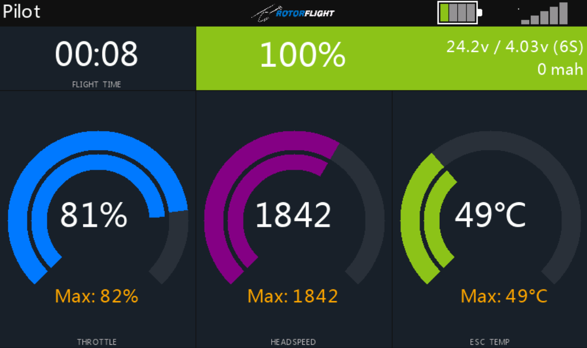 | 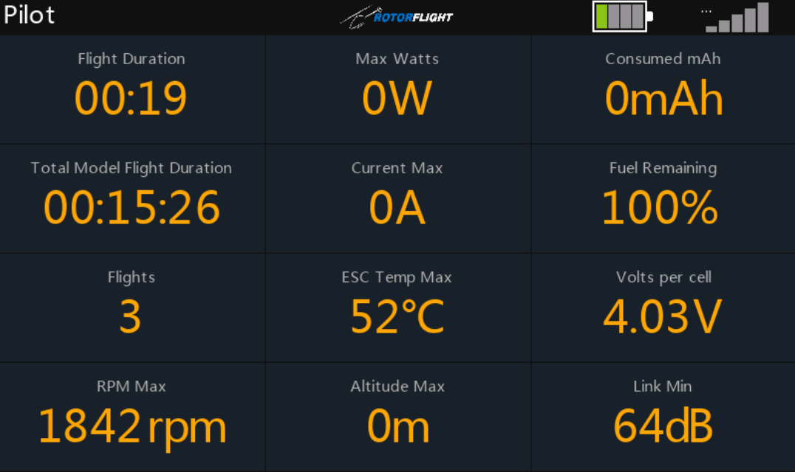 |

## AERC-Nitro

| Preflight | Inflight | Postflight |
| --- | --- | --- |
|  | 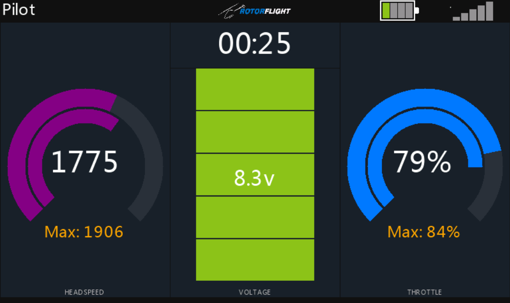 |  |

## Basic Timer

| Preflight | Inflight | Postflight |
| --- | --- | --- |
|  |  |  |

## Claude

| Preflight | Inflight | Postflight |
| --- | --- | --- |
| 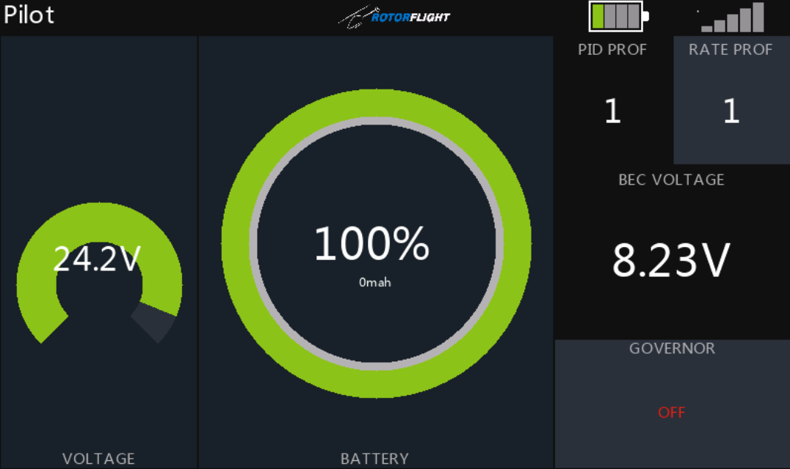 | 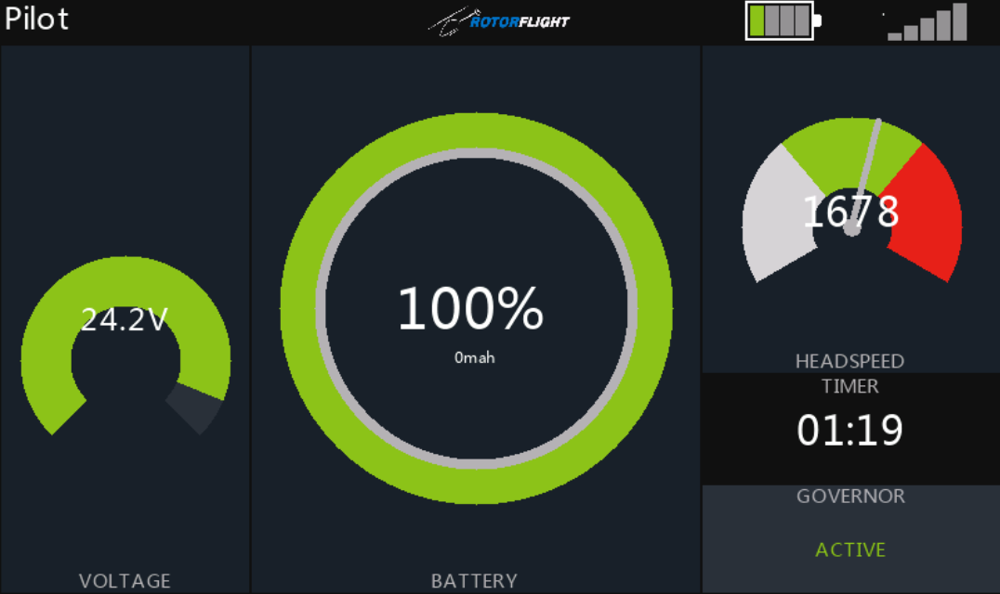 |  |

## DanielRC

| Preflight | Inflight | Postflight |
| --- | --- | --- |
|  |  | 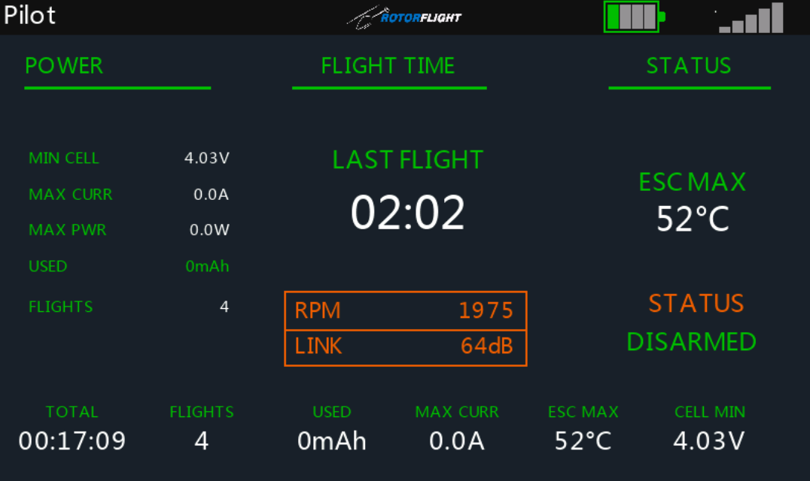 |

## Default

| Preflight | Inflight | Postflight |
| --- | --- | --- |
| 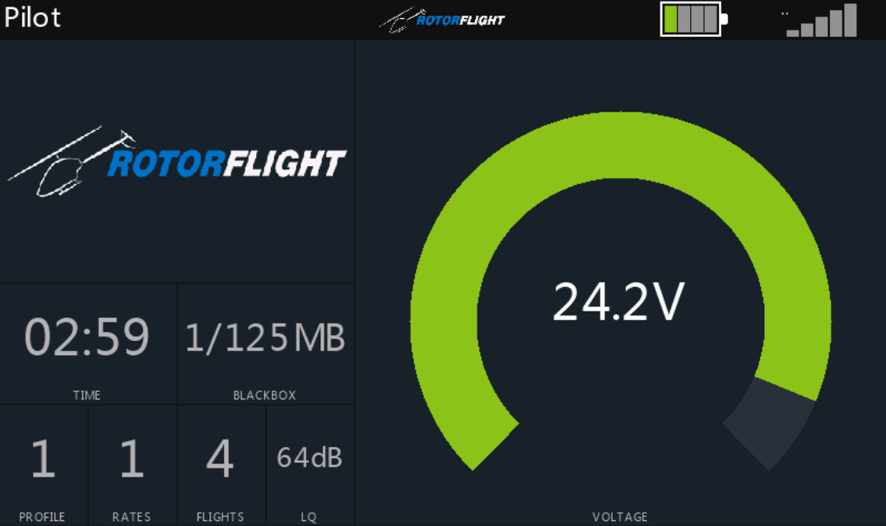 | 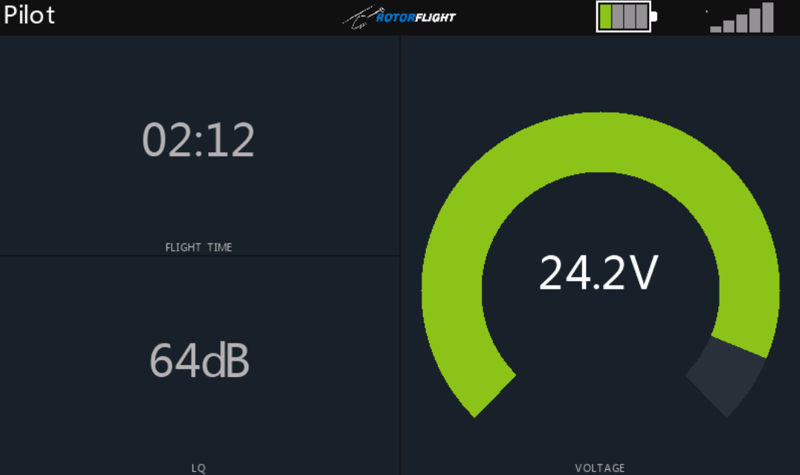 |  |

## Gismo

| Preflight | Inflight | Postflight |
| --- | --- | --- |
|  |  |  |

## Kevd

| Preflight | Inflight | Postflight |
| --- | --- | --- |
| 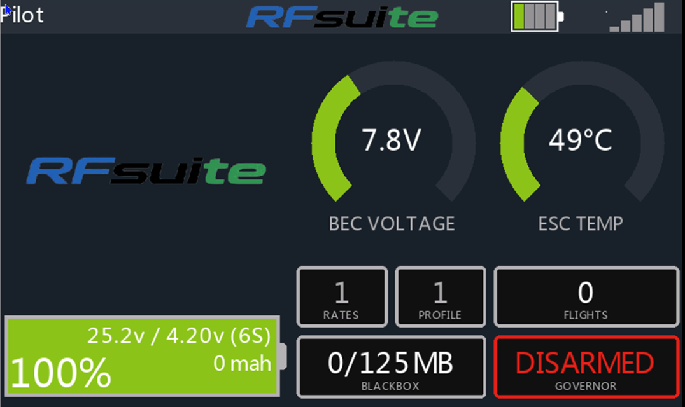 | 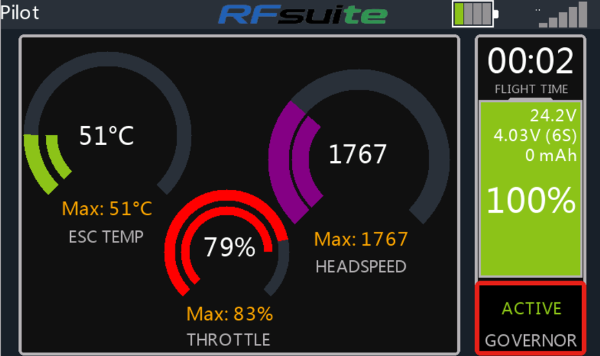 | 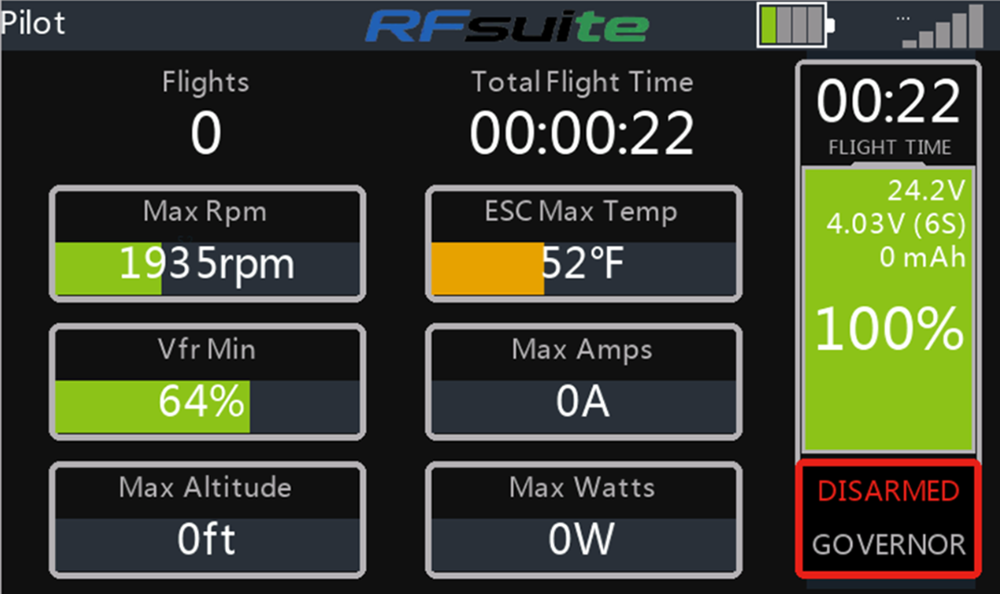 |

## RF Status

| Preflight | Inflight | Postflight |
| --- | --- | --- |
|  |  |  |

## RT-RC

| Preflight | Inflight | Postflight |
| --- | --- | --- |
| 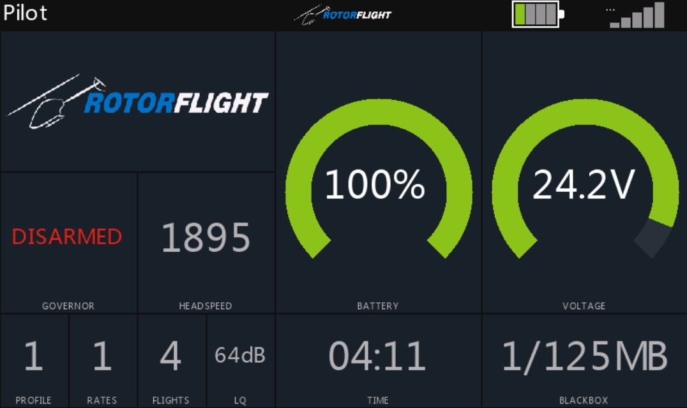 | 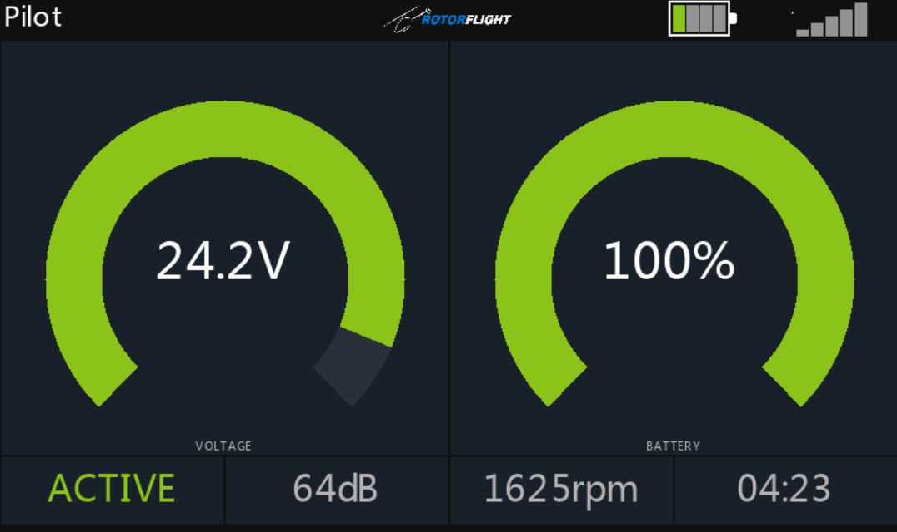 |  |

## RT-RC Nitro

| Preflight | Inflight | Postflight |
| --- | --- | --- |
|  |  |  |

## SRB-RC

| Preflight | Inflight | Postflight |
| --- | --- | --- |
|  |  |  |
